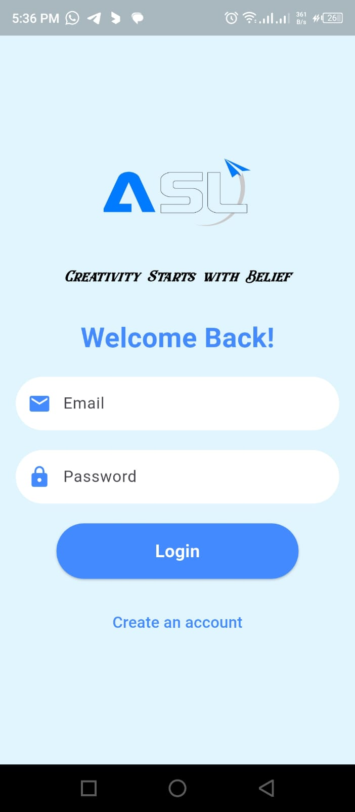
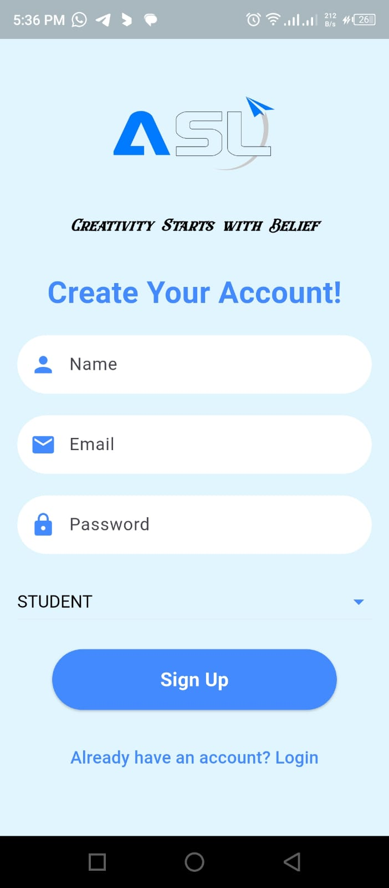
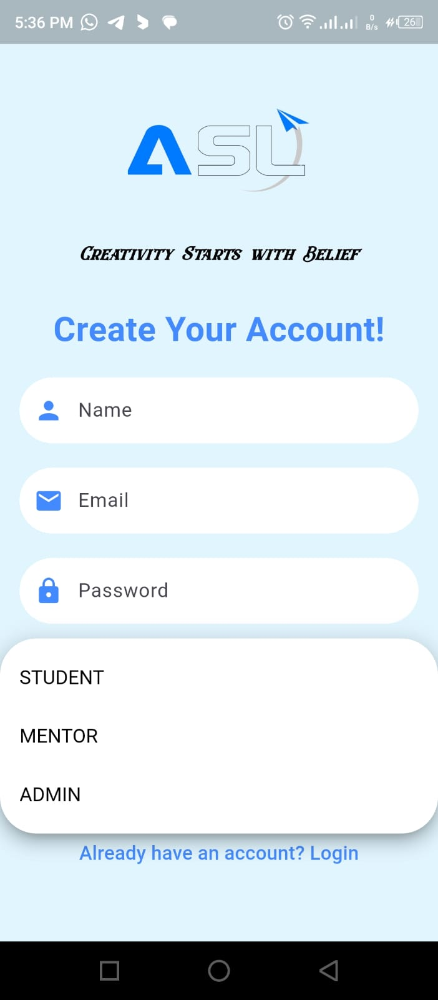
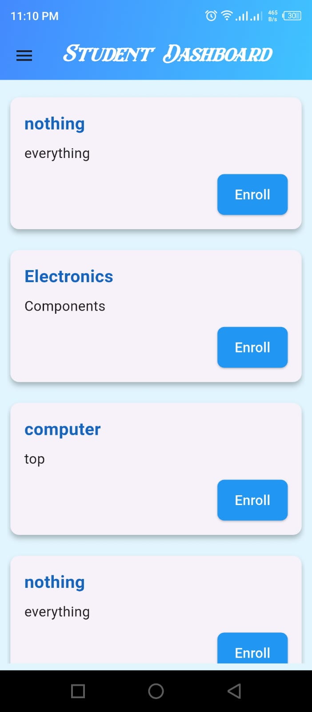
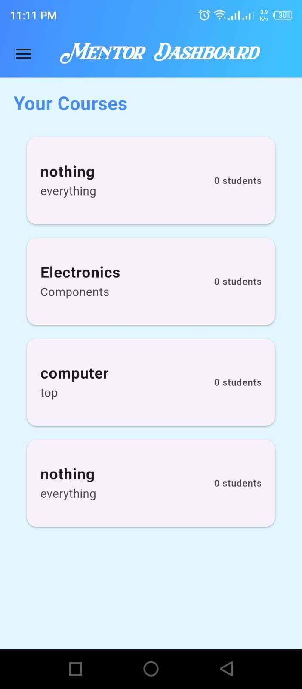
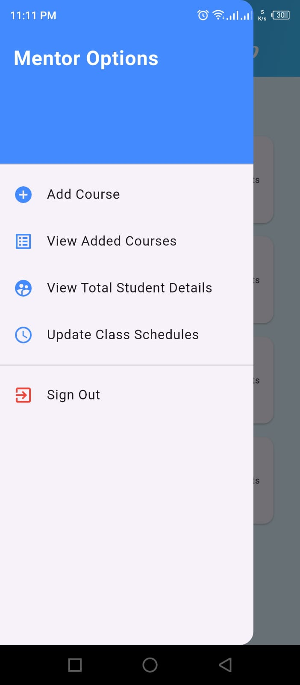

# Smart Class Scheduling System – Flutter & Firebase
This project is a Smart Class Scheduling System designed to streamline the process of course management and student enrollment. It is built using Flutter for the frontend and Firebase (Firestore, Authentication) for the backend. The system incorporates three distinct user roles: Students, Mentors, and Admins, each with specific functionalities to enhance efficiency and user experience.

## Key Features & Functionalities
__1. User Authentication & Role-Based Access__
  * Users sign up and log in using Firebase Authentication.
  * Each user selects their role (Student, Mentor, or Admin) during registration.
  * The app ensures that users access only the features relevant to their role.

__2. Mentor Functionality__
  * _Create & Manage Courses_ – Mentors can create courses by providing a title and description.
  * _Course Visibility_ – Once a course is created, it becomes available for students to view and enroll in.
  * _Student Enrollment Management_ – Mentors can track which students have joined their courses.

__3. Student Functionality__
  * _Browse Available Courses_ – Students can view all courses created by different mentors.
  * _Enroll in Courses_ – Students can select and enroll in their preferred courses.
  * _Personalized Dashboard_ – Shows enrolled courses and relevant details.

__4. Admin Functionality__
  * _User Management_ – Admins can add or remove students and mentors as needed.
  * _System Monitoring_ – Admins have an overview of all users, courses, and enrollments.

__5. Firestore Database Integration__
  * Stores user data, course information, and enrollment details.
  * Real-time synchronization ensures instant updates across the system.

__6. Secure Sign Out Feature__
  * Users can log out securely from their accounts.

## Splash Screen

  

## Login & Sign Up Page
<table align="center" style="border: none; border-collapse: collapse; cellspacing: 0; cellpadding: 0;">
  <tr>
    <td style="border: none; padding-right: 20px;">
      
    </td>
    <td style="border: none; padding-right: 20px;">
      
    </td>
    <td style="border: none;">
      
    </td>
  </tr>
</table>

## Student Functionality
<table align="center" style="border: none; border-collapse: collapse; cellspacing: 0; cellpadding: 0;">
  <tr>
    <td style="border: none; padding-right: 20px;">
      
    </td>
    <td style="border: none; padding-right: 20px;">
      
    </td>
    <td style="border: none;">
      
    </td>
  </tr>
</table>

## Mentor Functionality
<table align="center" style="border: none; border-collapse: collapse; cellspacing: 0; cellpadding: 0;">
  <tr>
    <td style="border: none; padding-right: 20px;">
      
    </td>
    <td style="border: none; padding-right: 20px;">
      
    </td>
    <td style="border: none;">
      
    </td>
  </tr>
</table>

## Project Benefits
  * _Seamless Course Management_ – Mentors can create and update courses effortlessly.
  * _Flexible Enrollment_ – Students have the freedom to choose classes based on their interests.
  * _Admin Control_ – Ensures smooth functioning and proper user management.
  * _Scalability_ – Built on Firebase, making it easy to scale as the number of users grows.

## Conclusion
This Smart Class Scheduling System enhances online learning experiences by providing a structured and efficient way for students to enroll in courses, mentors to manage their classes, and admins to oversee the platform. 🚀
